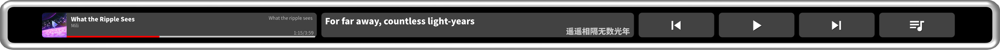

# NeteasePlugin

Netease Music control panel

<p align="center">
  
</p>


## Installation


### **Prerequisites**

- Node.js 18 or later  
- FlexDesigner v1.0.0 or later  
- A Flexbar device 
- Install FlexCLI  
  ```
  npm install -g @eniac/flexcli
  ```

### Clone & Setup

```
git clone .git
cd NeteasePlugin
npm install
```

## Debug

```
npm run dev
```

## Build & Pack

```
npm run build
npm run plugin:pack --path com.eniac.example.plugin
```
  
